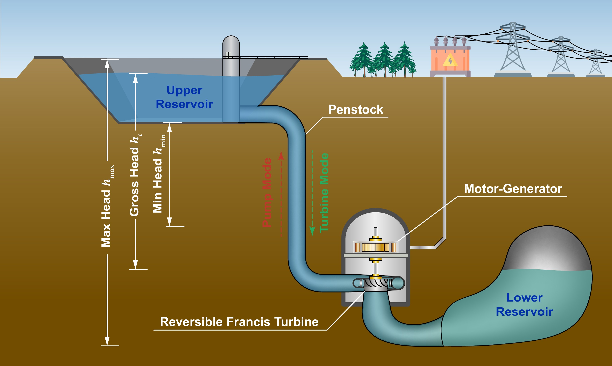
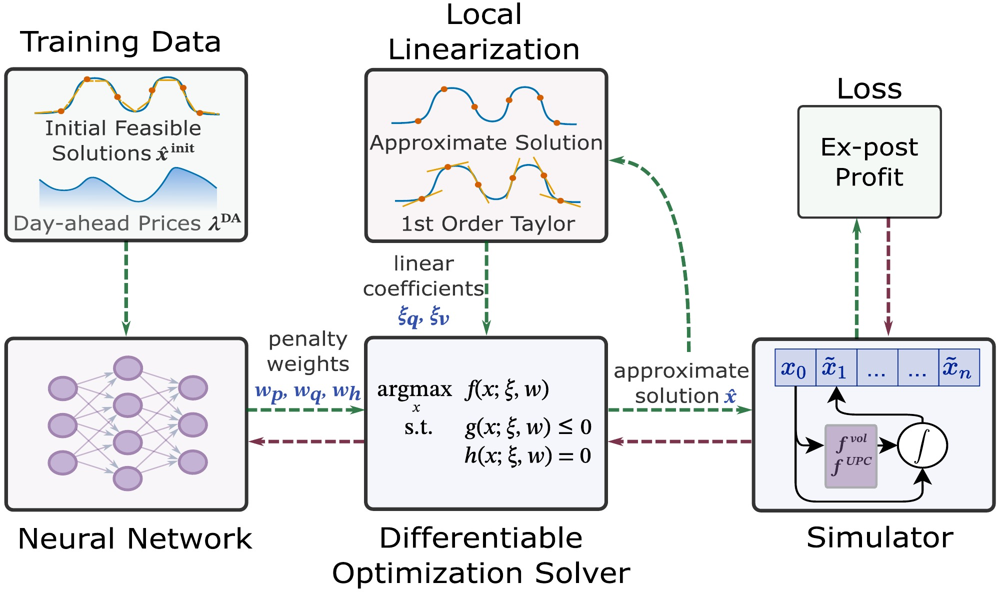
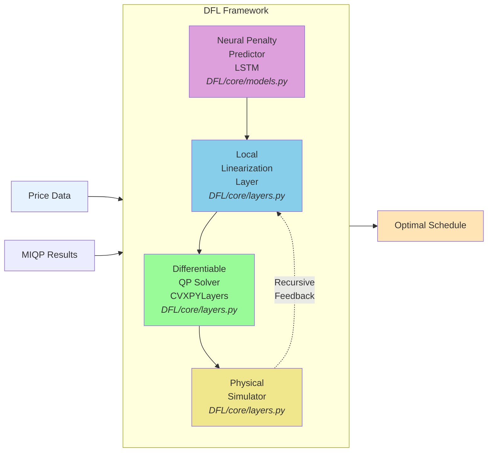
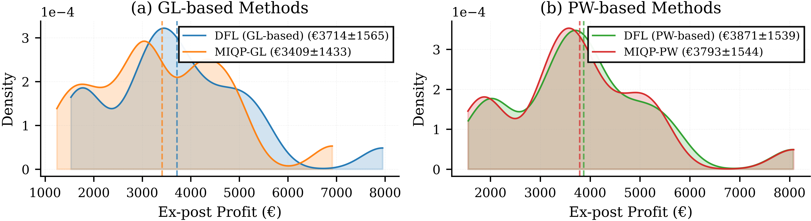
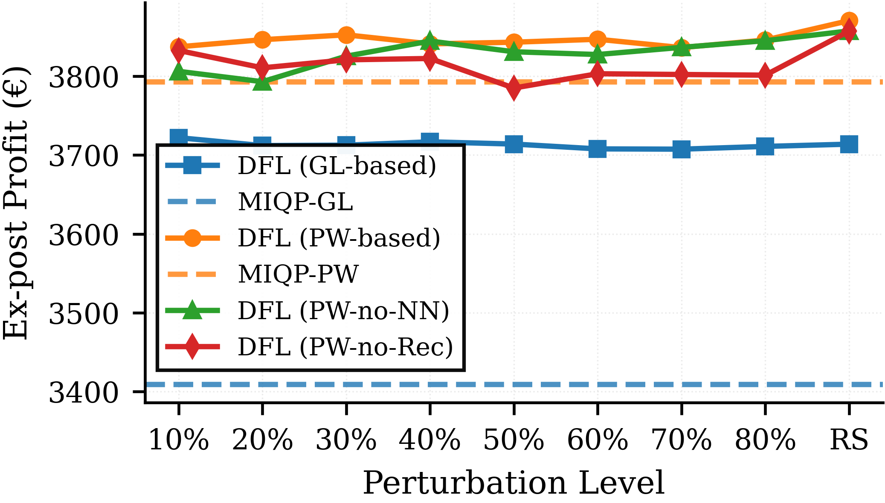
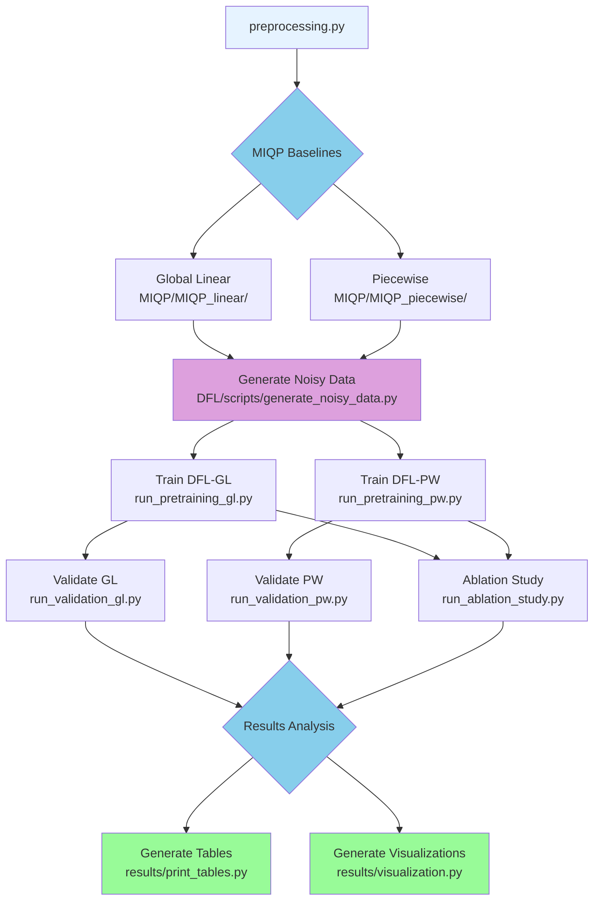

<h1 align="center">DFL-UPHES</h1>

<p align="center">
  <a href="https://doi.org/10.1109/TSTE.2026.3722492"></a>
  <a href="https://arxiv.org/abs/2512.20880"></a>
  <a href="https://www.python.org/downloads/"></a>
  <a href="https://pytorch.org/"></a>
  <a href="https://github.com/cvxgrp/cvxpylayers"></a>
  <a href="LICENSE"></a>
</p>

**Decision-Focused Learning for Underground Pumped Hydro Energy Storage Day-Ahead Scheduling**

Companion code for the paper ["Accelerating Underground Pumped Hydro Energy Storage Scheduling with Decision-Focused Learning"](https://doi.org/10.1109/TSTE.2026.3722492), accepted at *IEEE Transactions on Sustainable Energy*.

---

## The Scheduling Problem

Underground Pumped Hydro Energy Storage (UPHES) repurposes abandoned mines as the lower reservoir of a pumped hydro plant, enabling grid-scale storage where surface topography rules out conventional pumped hydro.

<p align="center">
  
</p>

Operating as a price taker in the day-ahead energy market, the plant maximizes its profit over a 24-hour horizon:

$$
\begin{aligned}
\max_{p_t,\, q_t,\, h_t,\, z_t^m} \quad & \sum_{t=1}^{24} \Delta t \left( \lambda_t^{\mathrm{DA}}\, p_t - C_{\mathrm{op}}\, p_t^{2} \right) && \text{maximize day-ahead market profit} \\
\text{s.t.} \quad & \sum_{m \in \lbrace I,T,P \rbrace} z_t^m = 1, \quad z_t^m \in \lbrace 0,1 \rbrace && \text{one mode per hour: idle, turbine, or pump} \\
& q_t = f_m^{\mathrm{UPC}}(p_t, h_t) && \text{nonlinear unit performance curves} \\
& v_t = v_{t-1} + \Delta t\, q_t, \quad h_t = f^{\mathrm{vol}\,-1}(v_t) && \text{reservoir dynamics and volume-head coupling} \\
& h_{\min} \leq h_t \leq h_{\max}, \quad v_{24} \leq v^{\mathrm{target}} && \text{head and terminal-volume limits}
\end{aligned}
$$

Here $p_t$, $q_t$, $h_t$, and $v_t$ denote net power, water flow, hydraulic head, and stored volume. The non-convex physics and binary mode decisions make the problem an intractable MINLP: its piecewise (SOS2) MIQP approximation is accurate but requires about half an hour per schedule, while the fast global-linear approximation sacrifices significant profit.

## The DFL Framework

Decision-Focused Learning (DFL) trains models directly on the downstream decision objective. Our DFL framework refines any feasible schedule through recursive local linearization guided by learned penalty weights, and since every step is differentiable, the weight predictor is trained end-to-end on the ex-post profit of its schedules evaluated under the true nonlinear dynamics.

<p align="center">
  
</p>

The pipeline chains four differentiable components:

1. **Neural penalty predictor** (`DFL/core/models.py`): an LSTM maps prices and the warm-start schedule to time-varying penalty weights, which act as learned trust-region sizes.
2. **Local linearization layer** (`DFL/core/layers.py`): first-order Taylor expansions of the UPC and volume-head relationships around the current operating point.
3. **Differentiable convex optimizer** (`DFL/core/layers.py`): a CVXPYLayers QP refines the schedule under the linearized physics; modes are fixed by the warm-start, so no integer variables remain.
4. **Differentiable physical simulator** (`DFL/core/layers.py`): re-evaluates the schedule under the true nonlinear dynamics; the resulting ex-post profit is the training loss.

Steps 2-4 repeat for K = 7 recursive iterations with geometrically growing penalties (`DFL/core/pipeline.py`):



## Results at a Glance

Evaluated on 19 representative Belgian day-ahead price profiles (2024, Elia):

| Deployment mode | Warm-start source | Outcome |
|---|---|---|
| Refiner | Piecewise MIQP solution | +1.1% profit over MIQP-PW for about 1.2 s of post-processing |
| Real-time scheduler | Fast global-linear MIQP | 3.87 s end-to-end (about 300x speedup) within 3.6% of MIQP-PW profit |
| MIP-free deployment | Historical schedule lookup (no MIQP solver) | 92% of MIQP-PW profit at a 989x speedup on held-out days |

<p align="center">
  
</p>

Ablations: removing the neural penalty predictor costs 2.8% profit, removing recursion costs 1.0%. DFL profit stays nearly constant as warm-start corruption grows from 10% to 80%, while MIQP baselines degrade by 12 to 23%:

<p align="center">
  
</p>

---

## Installation

Requires Python 3.11 or newer.

```bash
git clone https://github.com/SOLARIS-JHU/DFL-UPHES.git
cd DFL-UPHES
pip install -r requirements.txt
python preprocessing.py   # one-time: rebuilds preprocess.pkl for your dill version
```

**Note**: Gurobi with a valid license is required only for generating the MIQP baselines. DFL training and validation use the open-source ECOS solver.

## Quick Start

```bash
# 1. Generate training data (perturbed MIQP schedules)
python DFL/scripts/generate_noisy_data.py --variant GL --random-samples

# 2. Train the DFL model
python DFL/scripts/run_pretraining_gl.py

# 3. Validate on 2024 price scenarios
python DFL/scripts/run_validation_gl.py

# 4. Inspect results
cat DFL/outputs/validation_results/comprehensive/master_validation_benchmarks.csv
```

Trained models land in `DFL/outputs/trained_models/`, validation benchmarks in `DFL/outputs/validation_results/`.

A hands-on walkthrough is available as a Jupyter notebook: [](docs/dfl_uphes_mvp.ipynb)

---

## Full Pipeline



All commands run from the repository root.

**1. MIQP baselines** (requires Gurobi, several hours):

```bash
python MIQP/MIQP_linear/MIQP_global_linear.py     # global linearization
python MIQP/MIQP_piecewise/MIQP_piecewise.py      # piecewise SOS2
```

**2. Training data** (noise levels 10% to 80% plus the random-sampling variant used for headline results):

```bash
python DFL/scripts/generate_noisy_data.py --variant GL --noise-levels "0.1,0.2,0.3,0.4,0.5,0.6,0.7,0.8" --random-samples
python DFL/scripts/generate_noisy_data.py --variant PW --noise-levels "0.1,0.2,0.3,0.4,0.5,0.6,0.7,0.8" --random-samples
```

**3. Train** (LSTM, 3 layers, hidden 128, K = 7; one model per representative day):

```bash
python DFL/scripts/run_pretraining_gl.py          # GL-based DFL
python DFL/scripts/run_pretraining_pw.py          # PW-based DFL
python DFL/scripts/run_pretraining_pw_norec.py    # no-recursion ablation (K = 1)
```

Use `--n-jobs` to control parallelism (default 20 workers; `--n-jobs 1` for debugging, `--n-jobs -1` for all cores).

**4. Validate**:

```bash
python DFL/scripts/run_validation_gl.py
python DFL/scripts/run_validation_pw.py
python DFL/scripts/run_validation_pw_norec.py
python DFL/scripts/run_ablation_study.py          # fixed-weight (no-NN) ablation
```

Custom price scenarios can be passed with `--price-file ./my_prices.csv`.

**5. Aggregate and visualize**:

```bash
python results/aggregate_validation_results.py    # master benchmarks CSV
python results/print_tables.py                    # LaTeX and CSV tables
python results/visualization.py                   # publication figures
```

## Reproducing the Paper Experiments

| Paper result | Scripts |
|---|---|
| MIQP baseline performance (Table III) | `MIQP/MIQP_linear/MIQP_global_linear.py`, `MIQP/MIQP_piecewise/MIQP_piecewise.py` |
| DFL vs MIQP profit and timing (Table III, Fig. 4) | Training and validation scripts above, then `results/` scripts |
| Noise robustness (Fig. 5) | `DFL/scripts/generate_noisy_data.py`, `DFL/scripts/evaluate_noisy_miqp.py`, `results/visualization.py` |
| Component ablations (Table V, Fig. 6) | `DFL/scripts/run_pretraining_pw_norec.py`, `DFL/scripts/run_ablation_study.py` |
| IPOPT NLP baselines (Tables III, VI) | `DFL/scripts/run_ipopt_comparison.py` |
| Warm-start mode-error robustness (Fig. 7) | `DFL/scripts/run_mode_disagreement_audit.py`, `DFL/scripts/run_mode_perturbation.py`, `DFL/scripts/plot_mode_perturbation.py` |
| MIP-free deployment on held-out days (Table VI) | `DFL/scripts/select_oos_days.py`, then validation with `--price-file Data/price_data_2024_oos.csv` |
| Weight-predictor architecture comparison | `DFL/scripts/run_architecture_comparison.py`, `DFL/scripts/run_validation_architecture_comparison.py` |

## Repository Structure

```
DFL-UPHES/
├── Data/                     # Day-ahead prices and unit performance curves
├── DFL/                      # DFL framework
│   ├── config/               # Per-variant configuration classes
│   ├── core/                 # Models, differentiable layers, pipeline, parameters
│   ├── data/                 # Data loaders and noise injection
│   ├── training/             # End-to-end training loop
│   ├── validation/           # Model evaluation
│   ├── scripts/              # CLI entry points (see README_EXECUTION.md)
│   └── outputs/              # Generated data, models, and benchmarks
├── MIQP/                     # MIQP baselines (Gurobi)
├── Library/                  # Portfolio and system configuration
├── docs/                     # Tutorial notebook and architecture diagrams
├── figs/                     # README figures
├── linearization_error/      # Approximation accuracy analysis
├── results/                  # Aggregation, tables, and figures
├── preprocessing.py          # One-time preprocessing
└── requirements.txt
```

## Troubleshooting

**Missing `preprocess.pkl`**: run `python preprocessing.py` first.

**CVXPY solver errors**: ensure ECOS is installed (`pip install ecos`).

**Memory issues**: reduce parallel workers, e.g. `--n-jobs 4`.

**File not found errors**: run all commands from the repository root and check that `DFL/outputs/{noisy_data,trained_models,validation_results}` exist.

**Gurobi license errors**: Gurobi is only needed for MIQP baseline generation, not for DFL training or validation.

**scipy/ECOS compatibility**: a patch for scipy 1.13+ is applied automatically; no action needed.

---

## Citation

If you use this code in your research, please cite our paper:

```bibtex
@article{zheng2026accelerating,
  title={Accelerating Underground Pumped Hydro Energy Storage Scheduling with Decision-Focused Learning},
  author={Zheng, Honghui and Favaro, Pietro and Dvorkin, Yury and Drgo{\v{n}}a, J{\'a}n},
  journal={IEEE Transactions on Sustainable Energy},
  year={2026},
  note={Early Access},
  doi={10.1109/TSTE.2026.3722492}
}
```

IEEE Transactions on Sustainable Energy (Early Access): [https://doi.org/10.1109/TSTE.2026.3722492](https://doi.org/10.1109/TSTE.2026.3722492)
Accepted version (open access) on arXiv: [https://arxiv.org/abs/2512.20880](https://arxiv.org/abs/2512.20880)

## License

This project is licensed under the MIT License. See the [LICENSE](LICENSE) file for details.

## Contact

For questions, issues, or collaboration opportunities, open an issue on this repository or email [hzheng39@jh.edu](mailto:hzheng39@jh.edu).

## Acknowledgments

This work was supported by the [Ralph O'Connor Sustainable Energy Institute](https://energyinstitute.jhu.edu/).

Built on PyTorch, CVXPY, and CVXPYLayers.
