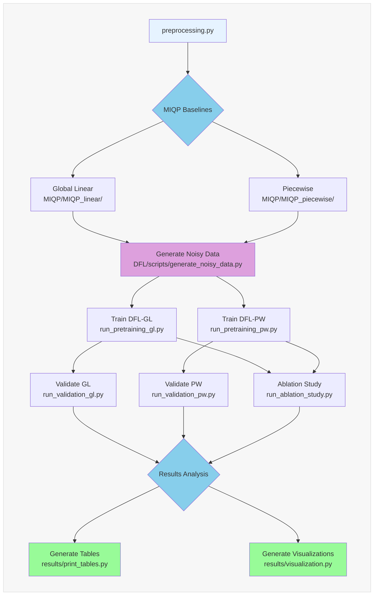
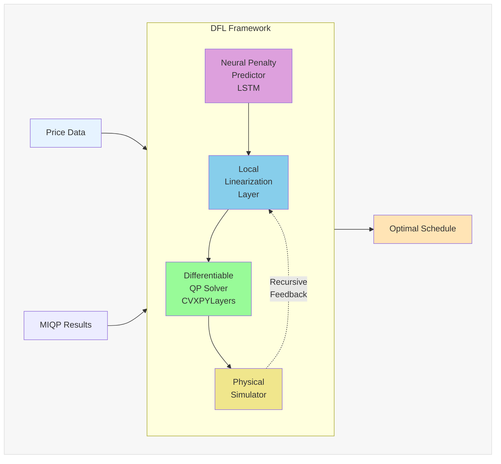

# Repository Diagram Section for README

Add this section to your main README.md file. The Mermaid diagrams will render automatically on GitHub!

---

## Repository Architecture

### Pipeline Workflow

The complete DFL-for-UPHES pipeline follows this workflow:



### Directory Structure

```
DFL-for-UPHES/
│
├── 📊 Data/                      # Input data and UPC information
│   ├── UPCs/                     # Unit Performance Curves
│   └── price_data_2024.csv       # Day-ahead electricity prices
│
├── 🧠 DFL/                        # Main DFL Framework (Refactored)
│   ├── config/                   # Configuration classes (GL/PW/Ablation)
│   ├── core/                     # Core DFL components
│   │   ├── models.py             # Neural penalty predictor (LSTM)
│   │   ├── layers.py             # Linearization, solver, simulator
│   │   └── pipeline.py           # Recursive refinement orchestrator
│   ├── data/                     # Data loaders and noise injection
│   ├── training/                 # End-to-end training procedures
│   ├── validation/               # Model evaluation
│   ├── utils/                    # Helper utilities
│   ├── scripts/                  # CLI entry points
│   │   ├── generate_noisy_data.py
│   │   ├── run_pretraining_gl.py
│   │   ├── run_pretraining_pw.py
│   │   ├── run_validation_gl.py
│   │   ├── run_validation_pw.py
│   │   └── run_ablation_study.py
│   └── outputs/                  # All generated outputs
│       ├── noisy_data/           # Training data (0-80% noise)
│       ├── trained_models/       # Neural network checkpoints
│       └── validation_results/   # Performance benchmarks
│
├── 🔢 MIQP/                       # MIQP Baseline Methods
│   ├── MIQP_linear/              # Global linearization baseline
│   └── MIQP_piecewise/           # Piecewise SOS2 baseline
│
├── 📦 Legacy/                     # Stable legacy implementations
│   ├── DFL_GL-based/             # GL training-data variant
│   ├── DFL_PW-based/             # PW training-data variant
│   └── DFL_no-NN/                # Ablation study baseline
│
├── 📈 results/                    # Publication outputs
│   ├── tables/                   # LaTeX & CSV comparison tables
│   ├── figures/                  # PDF & PNG visualizations
│   ├── print_tables.py           # Table generation script
│   └── visualization.py          # Visualization script
│
├── 🔬 linearization_error/        # Approximation accuracy analysis
├── 📚 Library/                    # System configuration files
├── 📄 preprocessing.py            # Preprocessing script
└── 📄 preprocess.pkl              # Preprocessed UPC data
```

### Component Architecture

The DFL framework consists of four differentiable components trained end-to-end:



### Key Features

- **🚀 Fast**: GL-based variant achieves near-real-time scheduling (<5s per day)
- **🎯 Accurate**: PW variant matches MIQP quality with 100x speedup
- **🔄 End-to-End**: Differentiable pipeline for gradient-based optimization
- **📊 Comprehensive**: Extensive validation across noise levels and scenarios
- **🧪 Reproducible**: Modular codebase with clear separation of concerns

<!-- ---

## Alternative Visualizations

For publication-quality diagrams, you can generate PNG/PDF versions:

```bash
# Install graphviz (optional)
pip install graphviz

# Generate diagrams
python docs/generate_repo_diagram.py
```

This creates:
- `docs/workflow_diagram.png` - Complete pipeline workflow
- `docs/directory_structure.png` - Directory tree visualization
- `docs/architecture_diagram.png` - Component architecture
 -->
