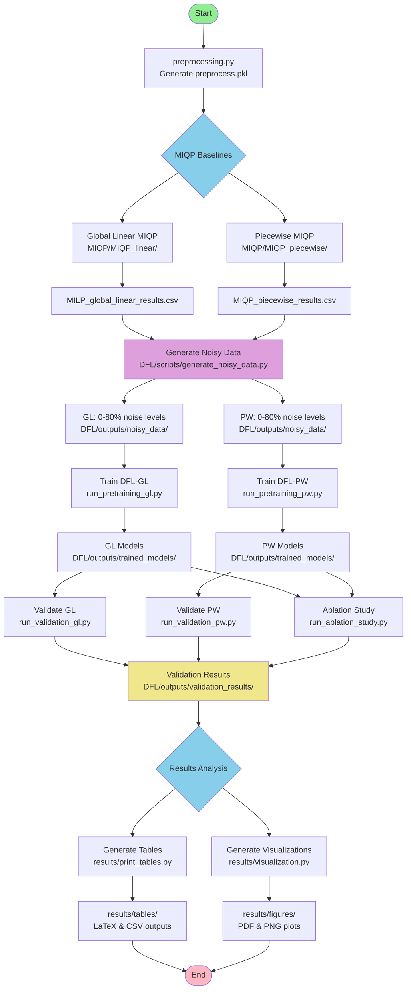
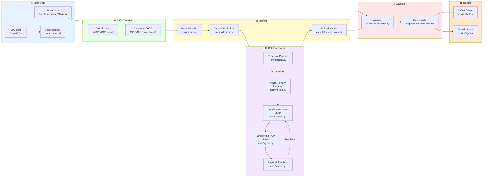

# Repository Graphs for DFL-for-UPHES

## 1. Pipeline Workflow



## 2. Directory Structure

```mermaid
graph TB
    Root[DFL-for-UPHES/] --> Data[📁 Data/]
    Root --> DFL[📁 DFL/]
    Root --> MIQP[📁 MIQP/]
    Root --> Legacy[📁 Legacy DFL/]
    Root --> Results[📁 results/]
    Root --> Lib[📁 Library/]
    Root --> LinErr[📁 linearization_error/]
    Root --> Files[📄 Root Files]

    Data --> UPCs[📁 UPCs/<br/>Unit Performance Curves]
    Data --> PriceData[📄 price_data_2024.csv]

    DFL --> Config[📁 config/<br/>GL/PW/Ablation configs]
    DFL --> Core[📁 core/<br/>Models, Layers, Pipeline]
    DFL --> DFLData[📁 data/<br/>Loaders & Noise]
    DFL --> Training[📁 training/<br/>Pretraining & Trainer]
    DFL --> Validation[📁 validation/<br/>Validator]
    DFL --> Scripts[📁 scripts/<br/>CLI entry points]
    DFL --> Utils[📁 utils/<br/>Helpers]
    DFL --> Outputs[📁 outputs/<br/>Generated data & results]

    Outputs --> NoisyData[📁 noisy_data/]
    Outputs --> TrainedModels[📁 trained_models/]
    Outputs --> ValResults[📁 validation_results/]

    MIQP --> MIQPLinear[📁 MIQP_linear/<br/>Global linearization]
    MIQP --> MIQPPW[📁 MIQP_piecewise/<br/>SOS2 constraints]

    Legacy --> DFLGL[📁 DFL_GL-based/<br/>Stable GL experiments]
    Legacy --> DFLPW[📁 DFL_PW-based/<br/>Stable PW experiments]
    Legacy --> DFLNoNN[📁 DFL_no-NN/<br/>Ablation baseline]

    Results --> Tables[📁 tables/<br/>LaTeX & CSV]
    Results --> Figures[📁 figures/<br/>PDF & PNG]
    Results --> Scripts2[📄 print_tables.py<br/>📄 visualization.py]

    LinErr --> PrelimResults[📁 preliminary_results/<br/>Accuracy assessments]

    Files --> Preprocess[📄 preprocessing.py<br/>📄 preprocess.pkl]
    Files --> Requirements[📄 requirements.txt]
    Files --> README[📄 README.md]

    style Root fill:#FFE4B5
    style DFL fill:#87CEEB
    style MIQP fill:#98FB98
    style Legacy fill:#DDA0DD
    style Results fill:#FFB6C1
    style Outputs fill:#F0E68C
```



## 3. Component Architecture



## 4. Simplified Repository Tree

```
DFL-for-UPHES/
├── 📊 Data/
│   ├── UPCs/                    # Unit Performance Curves
│   └── price_data_2024.csv      # Day-ahead prices
│
├── 🧠 DFL/                       # Refactored DFL Framework
│   ├── config/                  # GL/PW/Ablation configurations
│   ├── core/                    # Models, layers, pipeline
│   ├── data/                    # Loaders & noise injection
│   ├── training/                # Pretraining & trainer
│   ├── validation/              # Validator
│   ├── utils/                   # Helpers
│   ├── scripts/                 # CLI entry points
│   │   ├── generate_noisy_data.py
│   │   ├── run_pretraining_gl.py
│   │   ├── run_pretraining_pw.py
│   │   ├── run_validation_gl.py
│   │   ├── run_validation_pw.py
│   │   └── run_ablation_study.py
│   └── outputs/                 # All generated outputs
│       ├── noisy_data/          # Training data with noise
│       ├── trained_models/      # Neural network checkpoints
│       └── validation_results/  # Benchmarks & metrics
│
├── 🔢 MIQP/                      # Mixed-Integer QP Baselines
│   ├── MIQP_linear/             # Global linearization
│   └── MIQP_piecewise/          # SOS2 piecewise
│
├── 📦 Legacy DFL/                # Stable legacy experiments
│   ├── DFL_GL-based/            # GL training-data variant
│   ├── DFL_PW-based/            # PW training-data variant
│   └── DFL_no-NN/               # Ablation without NN
│
├── 📈 results/                   # Publication outputs
│   ├── tables/                  # LaTeX & CSV tables
│   ├── figures/                 # PDF & PNG plots
│   ├── print_tables.py          # Generate comparison tables
│   └── visualization.py         # Generate plots
│
├── 🔬 linearization_error/       # Approximation accuracy
├── 📚 Library/                   # Portfolio & system config
├── 📄 preprocessing.py           # Generate preprocess.pkl
├── 📄 preprocess.pkl             # Preprocessed UPC data
└── 📄 requirements.txt           # Python dependencies
```
